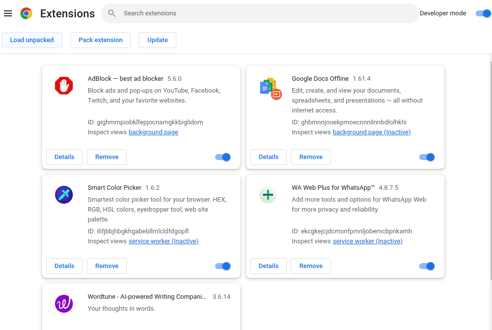
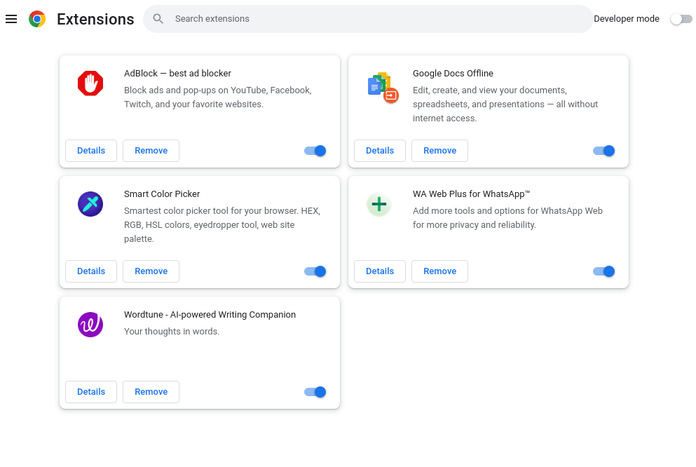
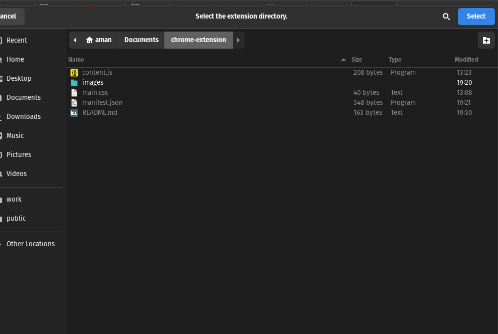
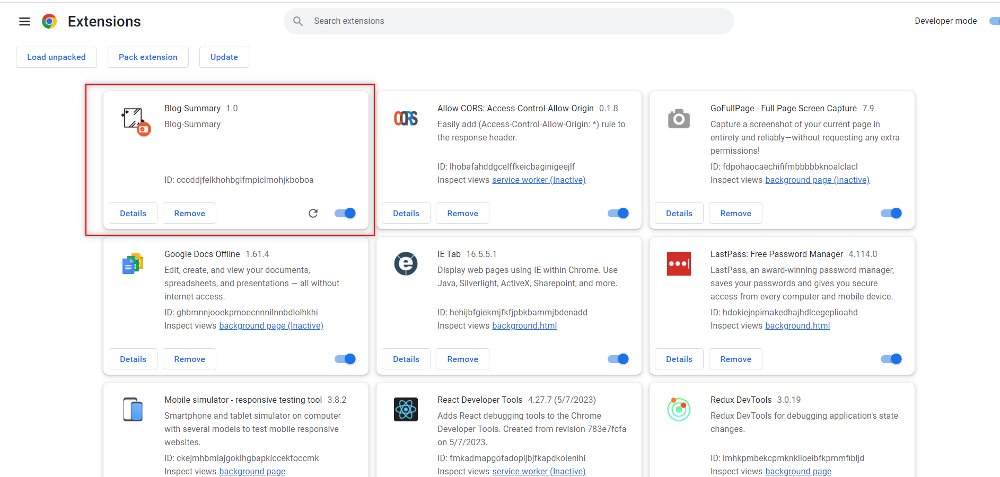
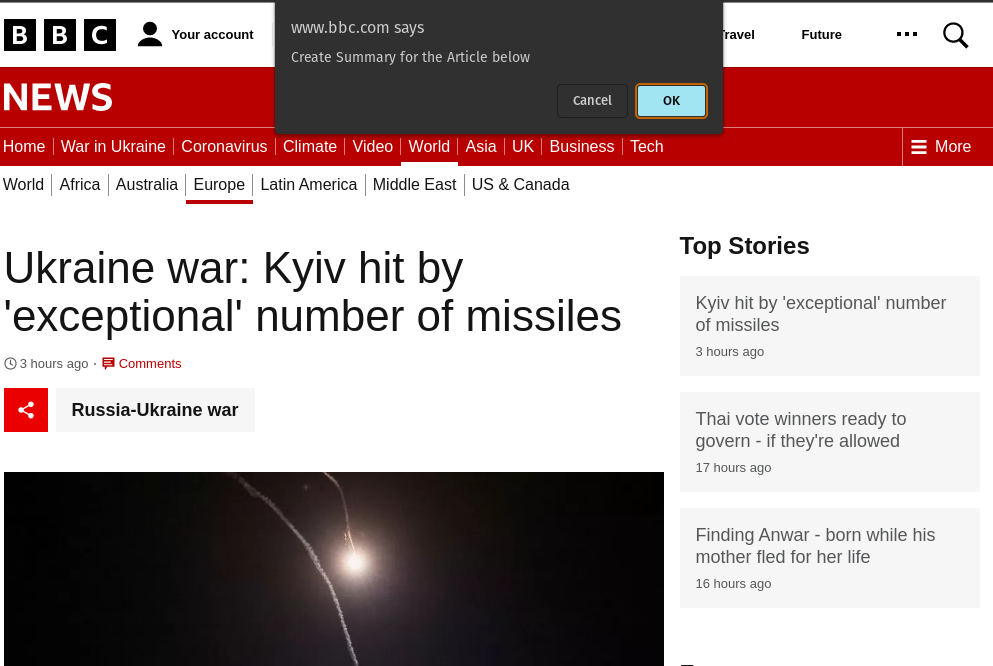
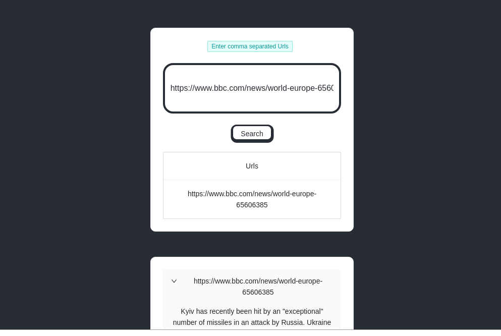

# BBC blog-summary

### Note :

```
Before running the project make sure the docker package is installed and all the globally reqired npm pacakages are installed.

In linux append sudo when executing below mentioned docker command.(Incase of error)
```

---

## Steps to run the project

#### (1). Make sure you are at the root

#### (2). Configure env's

##### (Root) .env (Note : The database credentials should be same in backend env)

```
POSTGRES_USER=root
POSTGRES_PASSWORD=1234
POSTGRES_DB=blog-summary
PGADMIN_DEFAULT_EMAIL=admin@admin.com
PGADMIN_DEFAULT_PASSWORD=admin
```

##### (Backend) .env (Note : The database credentials should be same as in docker.en in root. You can use same env except the openAi key)

```
# Database creds
DB_PORT=5432
DB_HOST=postgres
DB_USERNAME=root
DB_PASSWORD=1234
DB_NAME=blog-summary

# OPEN AI KEY
# Open Ai key can be aquired from the link below
# https://platform.openai.com/account/api-keys
OPEN_AI_KEY=<key>

NODE_ENV=dev


POSTGRES_DB=blog-summary
POSTGRES_USER=root
POSTGRES_PASSWORD=1234
```

##### (Frontend) .env (kindly use the same below given env for frontend. As backend is configured at port 4001)

```
REACT_APP_BACKEND_URL = 'http://localhost:4001'
```

#### (3). run "docker-compose up" command in terminal

#### (4). Project should be up and running by this time.

```
You can access project web interface(Frontend) at localhost:3000
```

---

## After Setting up project you can install google chrome extension by following the steps given below

##### (As the extension is not published developer mode procedure is required to install it)

## Steps to install chrome extension

#### 1. Go to extensions tab in chrome browser

#### 2. Enable Developer mode

#### 3. Click on Load unpacked

#### 4. Select extension folder

#### 5. After installing extension visit bbc article site[BBC Article](https://www.bbc.com/news/world-europe-65606385)

#### 6. You will be prompted to open summary page press yes

### Screen shots













## Front End

[README](./blog-summary-frontend//README.MD)

## Back End

[README](./blog-summary-backend//README.md)

## Chrome Extension

[README](./chrome-extension//README.md)
